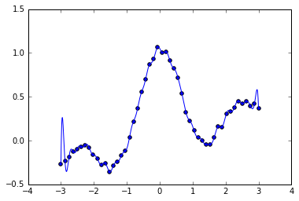

## Chap3.最小二乗学習


```python
import numpy as np
import numpy.matlib
import scipy as scip
import matplotlib.pyplot as plt
from sklearn import linear_model, datasets
%matplotlib inline
```

### 線形モデル


```python
#乱数によるデータ生成
np.random.seed(0)
regdata = datasets.make_regression(100, 1, noise=5.0)
plt.scatter(regdata[0],regdata[1])
```


    <matplotlib.collections.PathCollection at 0x1eed79e11d0>


```python
phi = np.c_[regdata[0],np.ones(100)]
reg = np.dot(np.linalg.pinv(phi) , regdata[1])
print(reg)
xr = np.linspace(-3,3,1000)
plt.plot(xr, reg[0] * xr + reg[1])
plt.scatter(regdata[0],regdata[1])
```

    [ 42.50246757  -0.40709091]
    


    <matplotlib.collections.PathCollection at 0x1eed82ad668>


### ガウスカーネルモデル


```python
#データ生成
from numpy.random import *
#from scipy.spatial.distance import pdist, squareform
n = 50
N = 1000
x = np.linspace(-3,3,n)[np.newaxis]
xr = np.linspace(-3,3,N)[np.newaxis]
y = np.sin(np.pi*x)/(np.pi*x) + 0.1*x + 0.1*rand(50)
plt.scatter(x,y)
```


    <matplotlib.collections.PathCollection at 0x1eed831d400>


```python
# ガウスカーネル計画行列を作成
# 1:学習時(input:d行が次元でn列のデータ)
def gaussker1(X, sigma):
    X_sum = np.sum(X**2, 0)[np.newaxis]
    shape = np.size(X_sum)
    return scip.exp(-(np.matlib.repmat(X_sum.T, 1, shape) + np.matlib.repmat(X_sum, shape, 1) -2 * np.dot(X.T, X))/(2 * sigma ** 2))
# 2:出力時
def gaussker2(x, X, sigma):
    return scip.exp(-(np.matlib.repmat((x ** 2), np.size(X), 1) + np.matlib.repmat((X ** 2).T, 1, np.size(x)) -2 * np.dot(X.T, x))/(2 * sigma ** 2))
```


```python
#回帰
sigma=0.3
K = gaussker1(x,sigma)
theta = np.linalg.solve(K,y.T)
KK = gaussker2(x,xr,sigma)
t = np.dot(KK,theta)
plt.scatter(x,y)
plt.plot(xr.T,t)
plt.ylim([-0.5,1.5])
```


    (-0.5, 1.5)




