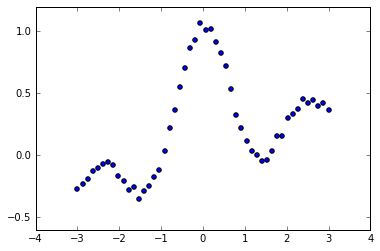

## Chap3.最小二乗学習


```python
#utf-8 python3
import numpy as np
import scipy as scip
import matplotlib.pyplot as plt
from sklearn import linear_model, datasets
%matplotlib inline
```

### 線形モデル


```python
#乱数によるデータ生成
np.random.seed(0)
regdata = datasets.make_regression(100, 1, noise=5.0)
plt.scatter(regdata[0],regdata[1])
```


    <matplotlib.collections.PathCollection at 0x1ea9853a828>


```python
phi = np.c_[regdata[0],np.ones(100)]
reg = np.dot(np.linalg.pinv(phi) , regdata[1])
print(reg)
xr = np.linspace(-3,3,1000)
plt.plot(xr, reg[0] * xr + reg[1])
plt.scatter(regdata[0],regdata[1])
```

    [ 42.50246757  -0.40709091]
    


    <matplotlib.collections.PathCollection at 0x1ea98cacc50>


### ガウスカーネルモデル


```python
#データ生成
from numpy.random import *
#from scipy.spatial.distance import pdist, squareform
n = 50
N = 1000
x = np.linspace(-3,3,n)[np.newaxis]
xr = np.linspace(-3,3,N)[np.newaxis]
y = np.sin(np.pi*x)/(np.pi*x) + 0.1*x + 0.1*rand(50)
plt.scatter(x,y)
```


    <matplotlib.collections.PathCollection at 0x1ea9a352898>





```python
#ガウスカーネル計画行列を作成
#1:学習時(input:d行が次元でn列のデータ)
def gaussker1(X,sigma):
    S = np.dot(X.T,X)
    size = np.shape(X)[1]
    s1 = np.zeros((size,size))
    s2 = np.zeros((size,size))
    for i in range(0,size):
        s1[i,:] = S[i,i] 
        s2[:,i] = S[i,i]
    return scip.exp(-(s1+s2-2*S)/(2*sigma**2))
#2:出力時
def gaussker2(x,X,sigma):
    n1 = np.shape(x)[1]
    n2 = np.shape(X)[1]
    Sx = np.dot(x.T,x)
    SX = np.dot(X.T,X)
    s1 = np.zeros((n2,n1))
    s2 = np.zeros((n2,n1))
    for i in range(0,n2):
        s1[i,:] = SX[i,i]
    for i in range(0,n1):
        s2[:,i] = Sx[i,i]
    return scip.exp(-(s1+s2-2*np.dot(X.T,x))/(2*sigma**2))
```


```python
#回帰
lam=2*0.3**2
K = gaussker1(x,lam)
theta = np.linalg.solve(K,y.T)
KK = gaussker2(x,xr,lam)
t = np.dot(KK,theta)
plt.scatter(x,y)
plt.plot(xr.T,t)
plt.ylim([-0.5,1.5])
```


    (-0.5, 1.5)


