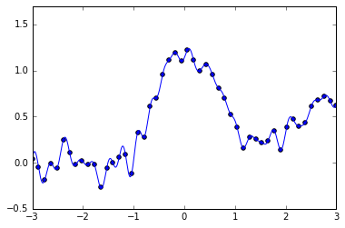
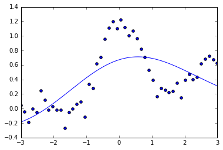
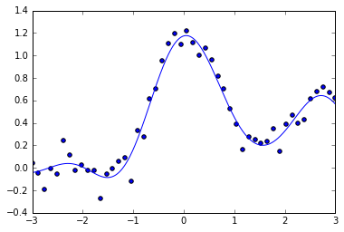

## Chap4.制約付き最小二乗学習


```python
import numpy as np
import scipy as scip
import matplotlib.pyplot as plt
%matplotlib inline
```


```python
# ガウスカーネル計画行列を作成
# 1:学習時(input:d行が次元でn列のデータ)
def gaussker1(X, sigma):
    S = np.dot(X.T, X)
    size = np.shape(X)[1]
    s1 = np.zeros((size, size))
    s2 = np.zeros((size, size))
    for i in range(0, size):
        s1[i, :] = S[i, i]
        s2[:, i] = S[i, i]
    return scip.exp(-(s1 + s2 - 2 * S) / (2 * sigma ** 2))
# 2:出力時
def gaussker2(x, X, sigma):
    n1 = np.shape(x)[1]
    n2 = np.shape(X)[1]
    Sx = np.dot(x.T, x)
    SX = np.dot(X.T, X)
    s1 = np.zeros((n2, n1))
    s2 = np.zeros((n2, n1))
    for i in range(0, n2):
        s1[i, :] = SX[i, i]
    for i in range(0, n1):
        s2[:, i] = Sx[i, i]
    return scip.exp(-(s1 + s2 - 2 * np.dot(X.T, x)) / (2 * sigma ** 2))
```

### 過学習の例


```python
from numpy.random import *
n = 50
N = 1000
x = np.linspace(-3,3,n)[np.newaxis]
xr = np.linspace(-3,3,N)[np.newaxis]
y = np.sin(np.pi*x)/(np.pi*x) + 0.1*x + 0.4*rand(50)

lam=2*0.3**2
K = gaussker1(x,lam)
theta = np.linalg.solve(K,y.T)
KK = gaussker2(x,xr,lam)
t = np.dot(KK,theta)
plt.scatter(x,y)
plt.plot(xr.T,t)
plt.xlim([-3,3])
plt.ylim([-0.5,1.7])
```


    (-0.5, 1.7)





### Lidge


```python
sigma = 0.5
lam = 0.2
K = gaussker1(x, sigma)
theta = np.linalg.solve(np.dot(K,K)+lam * np.matrix(np.identity(n)),np.dot(K.T,y.T))
KK = gaussker2(x, xr, sigma)
t = np.dot(KK,theta)
plt.scatter(x,y)
plt.plot(xr.T,t)
plt.xlim([-3,3])
```


    (-3, 3)


### Cross Validation(K-Fold)


```python
#リッジ回帰のクロスバリデーション
from sklearn.cross_validation import train_test_split as crv
from sklearn.cross_validation import KFold
# 訓練→誤差を返す
def Ridge_traintoer(x_train, x_test, y_train, y_test, xr, lam, sigma):
    n = np.shape(x_train)[0]
    K = gaussker1(x_train.T, sigma)
    theta = np.linalg.solve(np.dot(K, K) + lam * np.matrix(np.identity(np.size(x_train))), np.dot(K.T, y_train))
    KK = gaussker2(x_train.T, xr, sigma)
    t = np.dot(KK, theta)
    a = np.zeros((np.shape(x_test)[0], 1), dtype=np.int)
    for i in range(0, np.shape(x_test)[0]):
        a[i] = np.argmin((xr.T - x_test[i]) * (xr.T - x_test[i]))
    y_test_s = t[a[:]][:, :, 0]
    return np.sum((y_test - y_test_s) ** 2)
# 与えられたパラメータで回帰→図出力
def Ridge_expfig(x, xr, y, lam, sigma):
    n = np.shape(x)[1]
    K = gaussker1(x, sigma)
    theta = np.linalg.solve(np.dot(K, K) + lam * np.matrix(np.identity(n)), np.dot(K.T, y.T))
    KK = gaussker2(x, xr, sigma)
    t = np.dot(KK, theta)
    plt.scatter(x, y)
    plt.plot(xr.T, t)
    plt.xlim([-3, 3])
# K-Fold CV  input:(sample_x, line_x, sample_y, lambda, par, fold数), output:汎化誤差の推定量と回帰結果
def Ridge_crossval(x, xr, y, lam, sigma, fold):
    n = np.shape(x)[1]
    kf = KFold(n, n_folds=fold, shuffle=True, random_state=1)
    i = 0
    error = np.zeros((fold, 1))
    for train, test in kf:
        x_train = x.T[train, :]
        y_train = y.T[train, :]
        x_test = x.T[test, :]
        y_test = y.T[test, :]
        error[i] = Ridge_traintoer(x_train, x_test, y_train, y_test, xr, lam, sigma)
        i += 1
    print(np.mean(error))
    Ridge_expfig(x, xr, y, lam, sigma)
```

#### パラメータ候補 sigma = 2,0.5, lam = 1,0.5


```python
fold = 4
lam= 1
sigma = 2
Ridge_crossval(x, xr, y , sigma, sigma, fold)
```

    1.47919064663
    





```python
lam=1
sigma = 0.5
Ridge_crossval(x, xr, y, lam, sigma, fold)
```

    0.218190503607
    





```python
lam= 0.5
sigma = 2
Ridge_crossval(x, xr, y, lam, sigma, fold)
```

    1.4681712107
    


```python
lam=0.5
sigma = 0.5
Ridge_crossval(x, xr, y, lam, sigma, fold)
```

    0.211270333532
    


