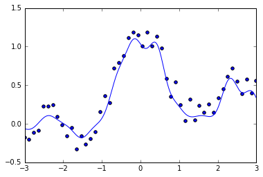
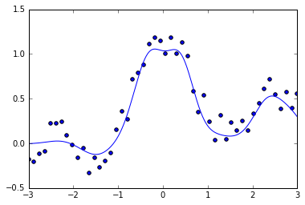
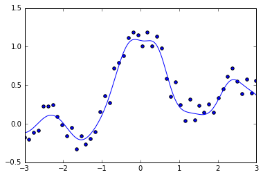

## Chap5.スパース学習


```python
import numpy as np
import scipy as scip
import matplotlib.pyplot as plt
%matplotlib inline
# ガウスカーネル計画行列を作成
# 1:学習時(input:d行が次元でn列のデータ)
def gaussker1(X, sigma):
    S = np.dot(X.T, X)
    size = np.shape(X)[1]
    s1 = np.zeros((size, size))
    s2 = np.zeros((size, size))
    for i in range(0, size):
        s1[i, :] = S[i, i]
        s2[:, i] = S[i, i]
    return scip.exp(-(s1 + s2 - 2 * S) / (2 * sigma ** 2))
# 2:出力時
def gaussker2(x, X, sigma):
    n1 = np.shape(x)[1]
    n2 = np.shape(X)[1]
    Sx = np.dot(x.T, x)
    SX = np.dot(X.T, X)
    s1 = np.zeros((n2, n1))
    s2 = np.zeros((n2, n1))
    for i in range(0, n2):
        s1[i, :] = SX[i, i]
    for i in range(0, n1):
        s2[:, i] = Sx[i, i]
    return scip.exp(-(s1 + s2 - 2 * np.dot(X.T, x)) / (2 * sigma ** 2))
```

### Lasso


```python
#Lasso
from numpy.random import *
n = 50
N = 1000
x = np.linspace(-3,3,n)[np.newaxis]
xr = np.linspace(-3,3,N)[np.newaxis]
y = np.sin(np.pi*x)/(np.pi*x) + 0.1*x + 0.4*rand(50)[np.newaxis]
plt.scatter(x,y)
```


    <matplotlib.collections.PathCollection at 0x2b965577978>


```python
sigma = 0.3
lam = 0.3
K = gaussker1(x, sigma)
K2 = np.dot(K.T,K)
Ky = np.dot(K.T,y.T)
theta0 = np.random.rand(n)[np.newaxis]
theta0 = theta0.T
for i in range(1,1000):
    theta =np.linalg.solve(K2 + lam*np.linalg.pinv(np.abs(np.diag(theta0[:,0]))), Ky)
    if np.linalg.norm(theta0-theta) < 0.00001:
        break
    theta0 = theta
KK = gaussker2(x, xr, sigma)
t = np.dot(KK, theta)
plt.scatter(x, y)
plt.plot(xr.T, t)
plt.xlim([-3, 3])
```


    (-3, 3)


```python
print(theta[theta > 0.0001])
```

    [  3.70356476e-04   2.24918908e-03   7.49546595e-04   3.53762279e-04
       1.22022925e-01   6.58753700e-01   1.85802606e-01   1.07136546e-01
       1.51588333e-01   7.36386676e-02   6.78624104e-02   4.39073835e-01
       2.42086410e-01   3.95284043e-02   1.86496341e-04   9.94012044e-02
       4.62920411e-02   2.78323071e-01   4.62079334e-02   3.56275401e-01
       2.24426283e-02]
    

### Lasso CV


```python
#Lasso回帰のクロスバリデーション
from sklearn.cross_validation import train_test_split as crv
from sklearn.cross_validation import KFold
# 訓練→誤差を返す
def Lasso_traintoer(x_train, x_test, y_train, y_test, xr, lam, sigma):
    n = np.shape(x_train)[0]
    K = gaussker1(x_train.T, sigma)
    K2 = np.dot(K.T,K)
    Ky = np.dot(K.T, y_train)
    theta0 = np.random.rand(n)[np.newaxis]
    theta0 = theta0.T
    for i in range(1,1000):
        theta =np.linalg.solve(K2 + lam*np.linalg.pinv(np.abs(np.diag(theta0[:,0]))), Ky)
        if np.linalg.norm(theta0-theta) < 0.0001:
            break
        theta0 = theta
    KK = gaussker2(x_train.T, xr, sigma)
    t = np.dot(KK, theta)
    a = np.zeros((np.shape(x_test)[0], 1), dtype=np.int)
    for i in range(0, np.shape(x_test)[0]):
        a[i] = np.argmin((xr.T - x_test[i]) * (xr.T - x_test[i]))
    y_test_s = t[a[:]][:, :, 0]
    return np.sum((y_test - y_test_s) ** 2)
#線の出力
def Lasso_expfig(x, xr, y, lam, sigma):
    K = gaussker1(x, sigma)
    K2 = np.dot(K.T,K)
    Ky = np.dot(K.T,y.T)
    theta0 = np.random.rand(n)[np.newaxis]
    theta0 = theta0.T
    for i in range(1,1000):
        theta =np.linalg.solve(K2 + lam*np.linalg.pinv(np.abs(np.diag(theta0[:,0]))), Ky)
        if np.linalg.norm(theta0-theta) < 0.0001:
            break
        theta0 = theta
    KK = gaussker2(x, xr, sigma)
    t = np.dot(KK, theta)
    plt.plot(xr.T, t)
# Lasso K-Fold CV  input:(sample_x, line_x, sample_y, lambda, par, fold数), output:汎化誤差の推定量と回帰結果
def Lasso_crossval(x, xr, y, lam, sigma, fold):
    n = np.shape(x)[1]
    kf = KFold(n, n_folds=fold, shuffle=True, random_state=1)
    i = 0
    error = np.zeros((fold, 1))
    for train, test in kf:
        x_train = x.T[train, :]
        y_train = y.T[train, :]
        x_test = x.T[test, :]
        y_test = y.T[test, :]
        error[i] = Lasso_traintoer(x_train, x_test, y_train, y_test, xr, lam, sigma)
        i += 1
    print(np.mean(error))
    Lasso_expfig(x, xr, y, lam, sigma)
```


```python
Fold = 4
```


```python
sigma = 0.3
lam = 0.3
Lasso_crossval(x, xr, y, lam , sigma, Fold)
plt.scatter(x, y)
plt.xlim([-3, 3])
```

    0.285021737485
    


    (-3, 3)


```python
sigma = 0.2
lam = 0.3
Lasso_crossval(x, xr, y, lam , sigma, Fold)
plt.scatter(x, y)
plt.xlim([-3, 3])
```

    0.41031677326
    


    (-3, 3)





```python
sigma = 0.4
lam = 0.3
Lasso_crossval(x, xr, y, lam , sigma, Fold)
plt.scatter(x, y)
plt.xlim([-3, 3])
```

    0.320255156926
    


    (-3, 3)


```python
sigma = 0.3
lam = 0.4
Lasso_crossval(x, xr, y, lam , sigma, Fold)
plt.scatter(x, y)
plt.xlim([-3, 3])
```

    0.313877461133
    


    (-3, 3)





```python
sigma = 0.3
lam = 0.2
Lasso_crossval(x, xr, y, lam , sigma, Fold)
plt.scatter(x, y)
plt.xlim([-3, 3])
```

    0.259251369409
    


    (-3, 3)




