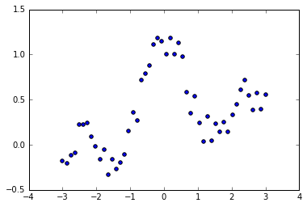

## Chap5.スパース学習


```python
import numpy as np
import scipy as scip
import matplotlib.pyplot as plt
%matplotlib inline
#多次元対応ガウスカーネル計画行列作成
#1:学習時(input:d行が次元でn列のデータ)
def gaussker1(X,sigma):
    S = np.dot(X.T,X)
    size = np.shape(X)[1]
    s1 = np.zeros((size,size))
    s2 = np.zeros((size,size))
    for i in range(0,size):
        s1[i,:] = S[i,i] 
        s2[:,i] = S[i,i]
    return scip.exp(-(s1+s2-2*S)/(2*sigma**2))
#2:出力時
def gaussker2(x,X,sigma):
    n1 = np.shape(x)[1]
    n2 = np.shape(X)[1]
    Sx = np.dot(x.T,x)
    SX = np.dot(X.T,X)
    s1 = np.zeros((n2,n1))
    s2 = np.zeros((n2,n1))
    for i in range(0,n2):
        s1[i,:] = SX[i,i]
    for i in range(0,n1):
        s2[:,i] = Sx[i,i]
    return scip.exp(-(s1+s2-2*np.dot(X.T,x))/(2*sigma**2))
#図出力
def expfig(x, xr, y,lam,par):
    n = np.shape(x)[1]
    K = gaussker1(x,lam)
    theta = np.linalg.solve(np.dot(K,K)+par * np.matrix(np.identity(n)),np.dot(K.T,y.T))
    KK = gaussker2(x,xr,lam)
    t = np.dot(KK,theta)
    plt.scatter(x,y)
    plt.plot(xr.T,t)
    plt.xlim([-3,3])
```

### Lasso


```python
#Lasso
from numpy.random import *
n = 50
N = 1000
x = np.linspace(-3,3,n)[np.newaxis]
xr = np.linspace(-3,3,N)[np.newaxis]
y = np.sin(np.pi*x)/(np.pi*x) + 0.1*x + 0.4*rand(50)[np.newaxis]
plt.scatter(x,y)
```


    <matplotlib.collections.PathCollection at 0x2997f7f6320>





```python
hh = 0.3
lam = 0.3
K = gaussker1(x, hh)
K2 = np.dot(K.T,K)
Ky = np.dot(K.T,y.T)
theta0 = np.random.rand(n)[np.newaxis]
theta0 = theta0.T
```


```python
for i in range(1,1000):
    theta =np.linalg.solve(K2 + lam*np.linalg.pinv(np.abs(np.diag(theta0[:,0]))), Ky)
    if np.linalg.norm(theta0-theta) < 0.00001:
        break
    theta0 = theta
expfig(x,xr,y,lam,hh)
```


```python
print(theta[theta > 0.0001])
```

    [  2.56959736e-01   1.26858667e-02   1.06602409e-04   1.34429517e-03
       4.76265877e-01   2.29265797e-01   1.94207110e-04   1.29705992e-01
       7.85720021e-01   1.67948461e-04   8.18171515e-02   3.80253499e-01
       8.53780933e-03   1.62574377e-03   1.46911914e-01   2.93005336e-01
       1.52929835e-04   1.71141755e-01   2.64991660e-01]
    

### Lasso CV


```python
#Lasso回帰のクロスバリデーション
from sklearn.cross_validation import train_test_split as crv
from sklearn.cross_validation import KFold
# 訓練→誤差を返す
def lasso_traintoer(x_train, x_test, y_train, y_test, xr, lam, par):
    n = np.shape(x_train)[0]
    K = gaussker1(x_train.T, lam)
    K2 = np.dot(K.T,K)
    Ky = np.dot(K.T, y_train)
    theta0 = np.random.rand(n)[np.newaxis]
    theta0 = theta0.T
    for i in range(1,1000):
        theta =np.linalg.solve(K2 + lam*np.linalg.pinv(np.abs(np.diag(theta0[:,0]))), Ky)
        if np.linalg.norm(theta0-theta) < 0.00001:
            break
        theta0 = theta
    KK = gaussker2(x_train.T, xr, lam)
    t = np.dot(KK, theta)
    a = np.zeros((np.shape(x_test)[0], 1), dtype=np.int)
    for i in range(0, np.shape(x_test)[0]):
        a[i] = np.argmin((xr.T - x_test[i]) * (xr.T - x_test[i]))
    y_test_s = t[a[:]][:, :, 0]
    return np.sum((y_test - y_test_s) ** 2)
#図出力
def expfig(x, xr, y,lam,par):
    n = np.shape(x)[1]
    K = gaussker1(x,lam)
    theta = np.linalg.solve(np.dot(K,K)+par * np.matrix(np.identity(n)),np.dot(K.T,y.T))
    KK = gaussker2(x,xr,lam)
    t = np.dot(KK,theta)
    plt.scatter(x,y)
    plt.plot(xr.T,t)
    plt.xlim([-3,3])
# Lasso K-Fold CV  input:(sample_x, line_x, sample_y, lambda, par, fold数), output:汎化誤差の推定量と回帰結果
def lasso_crossval(x,xr,y,lam,par,fold):
    n = np.shape(x)[1]
    kf = KFold(n, n_folds=fold, shuffle=True, random_state=1)
    i = 0
    error = np.zeros((fold, 1))
    for train, test in kf:
        x_train = x.T[train, :]
        y_train = y.T[train, :]
        x_test = x.T[test, :]
        y_test = y.T[test, :]
        error[i] = lasso_traintoer(x_train, x_test, y_train, y_test, xr, lam, par)
        i += 1
    print(np.mean(error))
    expfig(x, xr, y, lam, par)
```


```python
hh = 0.3
lam = 0.3
Fold = 4
lasso_crossval(x, xr, y, lam , hh, Fold)
```

    0.290259801172
    


```python
hh = 0.7
lam = 0.3
Fold = 4
lasso_crossval(x, xr, y, lam , hh, Fold)
```

    0.272961594519
    


```python
hh = 0.7
lam = 0.7
Fold = 4
lasso_crossval(x, xr, y, lam , hh, Fold)
```

    0.287281879174
    


