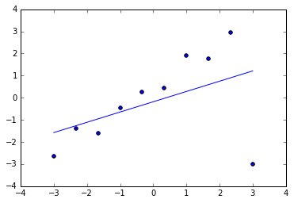
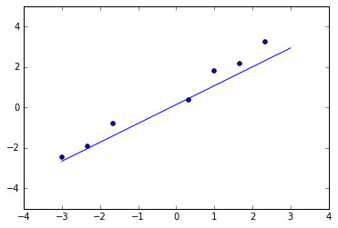
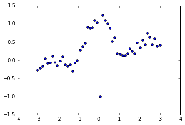
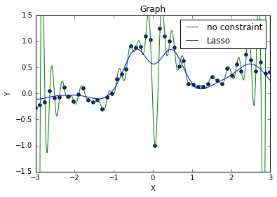
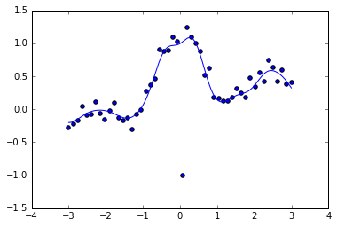
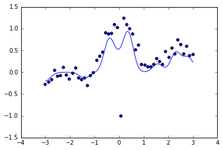

## Chapter6.ロバスト学習


```python
import numpy as np
import scipy as scip
import matplotlib.pyplot as plt
%matplotlib inline
```

## 外れ値のあるデータ


```python
n = 10; N = 1000; x = np.linspace(-3, 3, n)[np.newaxis]; xr = np.linspace(-3, 3, N)[np.newaxis]
y = x + np.random.rand(10)
y[0, 9] = -3
plt.scatter(x, y)
```


    <matplotlib.collections.PathCollection at 0x25162512a20>


### Chapter3の線形モデルを適用すると...


```python
phi = np.hstack([x.T, np.ones(n)[np.newaxis].T])
reg = np.dot(np.linalg.pinv(phi) , y.T)
plt.plot(xr.T, reg[0] * xr.T + reg[1])
plt.scatter(x,y)
```


    <matplotlib.collections.PathCollection at 0x25164ade7f0>





## フーバー損失最小化学習


```python
# データセット(上と同じ)
n = 10; N = 1000; x = np.linspace(-3, 3, n)[np.newaxis]; xr = np.linspace(-3, 3, N)[np.newaxis]
y = x + np.random.rand(10)
y[0, 9] = -3
plt.scatter(x, y)
```


    <matplotlib.collections.PathCollection at 0x25164b4b0f0>


```python
phi = np.hstack([x.T, np.ones(n)[np.newaxis].T])
# 通常の最小二乗学習の結果を初期値に採用
reg0 = np.dot(np.linalg.pinv(phi) , y.T)
eta = 1
yt = y.T
for i in range(0, 1000):
    # 残差を求める
    r = np.abs(np.dot(phi, reg0) - yt)
    w = np.ones(n)[np.newaxis].T; 
    # 残差が大きければ重み付けを小さく取る(閾値はeta)
    w[r>eta] = eta/r[r>eta]
    W = np.diag(w[:, 0])
    # 重み付け最小二乗学習
    reg = np.linalg.solve(np.dot(np.dot(phi.T, W), phi), np.dot(np.dot(phi.T, W), yt))
    if np.linalg.norm(reg - reg0) < 0.0001:
        break
    reg0 = reg
plt.plot(xr.T, reg[0] * xr .T+ reg[1])
plt.scatter(x, y)
```


    <matplotlib.collections.PathCollection at 0x25164bb7668>


## テューキー損失最小化学習


```python
#非常に強い異常値
n = 10; N = 1000; x = np.linspace(-3, 3, n)[np.newaxis]; xr = np.linspace(-3, 3, N)[np.newaxis]
y = x + np.random.rand(10)
y[0, 9] = -10; y[0, 3] = -50; y[0,4]  = -25

#フーバー損失を用いると...
phi = np.hstack([x.T, np.ones(n)[np.newaxis].T])
reg0 = np.dot(np.linalg.pinv(phi) , y.T); eta = 1; yt = y.T
for i in range(0, 1000):
    r = np.abs(np.dot(phi, reg0) - yt)
    w = np.ones(n)[np.newaxis].T; 
    w[r>eta] = eta/r[r>eta]; W = np.diag(w[:, 0])
    reg = np.linalg.solve(np.dot(np.dot(phi.T, W), phi), np.dot(np.dot(phi.T, W), yt))
    if np.linalg.norm(reg - reg0) < 0.0001:
        break
    reg0 = reg
plt.plot(xr.T, reg[0] * xr .T+ reg[1])
plt.scatter(x, y); plt.ylim([-5,5])
```


    (-5, 5)





```python
#テューキー損失(重み付けを変える)
phi = np.hstack([x.T, np.ones(n)[np.newaxis].T])
reg0 = np.dot(np.linalg.pinv(phi) , y.T); eta = 1; yt = y.T
eta = 10
for i in range(0, 1000):
    r = np.abs(np.dot(phi, reg0) - yt)
    w = np.zeros(n)[np.newaxis].T; 
    w[r <= eta] = (1-r[np.abs(r) <= eta]**2/(eta**2))**2
    W = np.diag(w[:, 0])
    reg = np.linalg.solve(np.dot(np.dot(phi.T, W), phi), np.dot(np.dot(phi.T, W), yt))
    if np.linalg.norm(reg - reg0) < 0.0001:
        break
    reg0 = reg
plt.plot(xr.T, reg[0] * xr .T+ reg[1])
plt.scatter(x, y); plt.ylim([-5,5])
```


    (-5, 5)


## l_1制約付きフーバー損失最小化学習(ガウスカーネル)


```python
# いつもの
# 1:学習時(input:d行が次元でn列のデータ)
def gaussker1(X,sigma):
    S = np.dot(X.T,X)
    size = np.shape(X)[1]
    s1 = np.zeros((size,size))
    s2 = np.zeros((size,size))
    for i in range(0,size):
        s1[i,:] = S[i,i] 
        s2[:,i] = S[i,i]
    return scip.exp(-(s1+s2-2*S)/(2*sigma**2))
# 2:出力時
def gaussker2(x,X,sigma):
    n1 = np.shape(x)[1]
    n2 = np.shape(X)[1]
    Sx = np.dot(x.T,x)
    SX = np.dot(X.T,X)
    s1 = np.zeros((n2,n1))
    s2 = np.zeros((n2,n1))
    for i in range(0,n2):
        s1[i,:] = SX[i,i]
    for i in range(0,n1):
        s2[:,i] = Sx[i,i]
    return scip.exp(-(s1+s2-2*np.dot(X.T,x))/(2*sigma**2))
# 線の出力
def expfig(x, xr, theta, sigma):
    KK = gaussker2(x, xr, sigma)
    t = np.dot(KK, theta)
    plt.plot(xr.T, t)
```


```python
# サンプルデータ
n = 50
N = 1000
x = np.linspace(-3,3,n)[np.newaxis]
xr = np.linspace(-3,3,N)[np.newaxis]
y = np.sin(np.pi*x)/(np.pi*x) + 0.1*x + 0.4*np.random.rand(50)[np.newaxis]
y[:,25] = -1
plt.scatter(x, y)
```


    <matplotlib.collections.PathCollection at 0x25164cf2d68>





```python
# 制約無しで回帰したりLassoしたり(ついでにmatplotlibの練習したり)
sigma = 0.3
lam = 0.3
K = gaussker1(x,sigma)
K2 = np.dot(K.T,K)
Ky = np.dot(K.T,y.T)
#制約無し
theta = np.linalg.solve(K,y.T)
KK = gaussker2(x,xr, sigma)
t = np.dot(KK,theta)
plt.plot(xr.T,t, "g", label = "no constraint")
# Lasso
theta0 = np.random.rand(n)[np.newaxis]
theta0 = theta0.T
for i in range(1,1000):
    theta =np.linalg.solve(K2 + lam*np.linalg.pinv(np.abs(np.diag(theta0[:,0]))), Ky)
    if np.linalg.norm(theta0-theta) < 0.00001:
        break
    theta0 = theta
t = np.dot(KK,theta)
plt.plot(xr.T,t, "b", label = "Lasso")
plt.scatter(x, y)
plt.xlim([-3, 3])
plt.ylim([-1.5, 1.5])
plt.title("Graph")
plt.xlabel("X")
plt.ylabel("Y")
plt.legend()
```


    <matplotlib.legend.Legend at 0x25165624080>





```python
#フーバー損失を考えてみる
sigma = 0.3
lam = 0.1
eta = 0.1
yt = y.T
K = gaussker1(x, sigma)
K2 = np.dot(K.T,K)
Ky = np.dot(K.T,y.T)
# 制約なしバージョンを初期値に採用
theta0 = np.linalg.solve(K, y.T)
for i in range(1,1000):
    r = np.abs(np.dot(K, theta0) - yt)
    w = np.ones(n)[np.newaxis].T; 
    w[r>eta] = eta/r[r>eta]; W = np.diag(w[:, 0])
    theta = np.linalg.solve(np.dot(np.dot(K.T, W), K) 
                           + lam * np.linalg.pinv(np.abs(np.diag(theta0[:,0])))
                           , np.dot(np.dot(K.T, W), yt))
    if np.linalg.norm(theta0-theta) < 0.00001:
        break
    theta0 = theta
expfig(x, xr, theta, sigma)
plt.scatter(x, y)
```


    <matplotlib.collections.PathCollection at 0x251655f0cf8>





## Lasso_Huber CrossValidation


```python
#とりあえず作ったけど、汎化誤差の推定量をどうするか...
from sklearn.cross_validation import train_test_split as crv
from sklearn.cross_validation import KFold
# 訓練→誤差を返す
def Lasso_Huber_traintoer(x_train, x_test, y_train, y_test, xr, lam, sigma, eta):
    n = np.shape(x_train)[0]
    K = gaussker1(x_train.T, sigma)
    K2 = np.dot(K.T,K)
    Ky = np.dot(K.T, y_train)
    y_train_t = y_train
    theta0 = np.linalg.solve(K, y_train_t)
    for i in range(1,1000):
        r = np.abs(np.dot(K, theta0) - y_train_t)
        w = np.ones(n)[np.newaxis].T; 
        w[r>eta] = eta/r[r>eta]; W = np.diag(w[:, 0])
        theta = np.linalg.solve(np.dot(np.dot(K.T, W), K) 
                           + lam * np.linalg.pinv(np.abs(np.diag(theta0[:,0])))
                           , np.dot(np.dot(K.T, W), y_train_t))
        if np.linalg.norm(theta0-theta) < 0.0001:
            break
        theta0 = theta
    KK = gaussker2(x_train.T, xr, sigma)
    t = np.dot(KK, theta)
    a = np.zeros((np.shape(x_test)[0], 1), dtype=np.int)
    for i in range(0, np.shape(x_test)[0]):
        a[i] = np.argmin((xr.T - x_test[i]) * (xr.T - x_test[i]))
    y_test_s = t[a[:]][:, :, 0]
    return np.sum((y_test - y_test_s) ** 2)
# input:(sample_x, line_x, sample_y, lambda, bandwidth, eta, fold数), output:汎化誤差の推定量と回帰結果
def Lasso_Huber_crossval(x, xr, y, lam, sigma, eta, fold):
    n = np.shape(x)[1]
    kf = KFold(n, n_folds=fold, shuffle=True, random_state=1)
    i = 0
    error = np.zeros((fold, 1))
    for train, test in kf:
        x_train = x.T[train, :]
        y_train = y.T[train, :]
        x_test = x.T[test, :]
        y_test = y.T[test, :]
        error[i] = Lasso_Huber_traintoer(x_train, x_test, y_train, y_test, xr, lam, sigma, eta)
        i += 1
    print(np.mean(error))
    expfig(x, xr, theta, sigma)
```


```python
sigma = 0.3
lam = 0.1
eta = 0.1
fold = 4
Lasso_Huber_crossval(x, xr, y, lam, sigma, eta, fold)
plt.scatter(x, y)
```

    1.92163506006
    


    <matplotlib.collections.PathCollection at 0x251607bb8d0>


```python
sigma = 0.3
lam = 0.1
eta = 0.2
Lasso_Huber_crossval(x, xr, y, lam, sigma, eta, fold)
plt.scatter(x, y)
```

    1.77115282689
    


    <matplotlib.collections.PathCollection at 0x25160826b38>


```python
sigma = 0.3
lam = 0.2
eta = 0.1
Lasso_Huber_crossval(x, xr, y, lam, sigma, eta, fold)
plt.scatter(x, y)
```

    1.81012035145
    


    <matplotlib.collections.PathCollection at 0x25160890b38>


```python
sigma = 0.2
lam = 0.1
eta = 0.1
Lasso_Huber_crossval(x, xr, y, lam, sigma, eta, fold)
plt.scatter(x, y)
```

    2.45932643706
    


    <matplotlib.collections.PathCollection at 0x251608f9b38>




