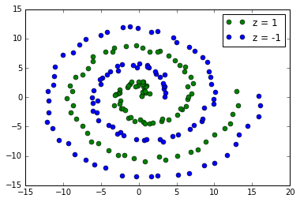
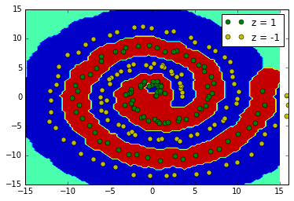

## Chapter7: 最小二乗分類

#### 手抜き


```python
import numpy as np
import numpy.matlib
import scipy as scip
import matplotlib.pyplot as plt
%matplotlib inline
```


```python
def gaussker1(X, sigma):
    X_sum = np.sum(X**2, 0)[np.newaxis]
    shape = np.size(X_sum)
    return scip.exp(-(np.matlib.repmat(X_sum.T, 1, shape) + np.matlib.repmat(X_sum, shape, 1) -2 * np.dot(X.T, X))/(2 * sigma ** 2))
def gaussker2(x, X, sigma):
    return scip.exp(-(np.matlib.repmat((x ** 2).T, 1, np.size(X)) + np.matlib.repmat((X ** 2), np.size(x), 1) -2 * np.dot(x.T, X))/(2 * sigma ** 2))
```


```python
#データセット
n = 200; a = np.linspace(0, 4*np.pi, n/2)
u = np.array([a*np.cos(a), (a+np.pi)*np.cos(a)]) + np.random.rand(2, 100)
v = np.array([a*np.sin(a), (a+np.pi)*np.sin(a)]) + np.random.rand(2, 100)
z = np.hstack([np.array(a * 0 + 1), np.array(a * 0 - 1)])[np.newaxis]
plt.plot(u[0], v[0], "og", label='z = 1')
plt.plot(u[1], v[1],  "ob", label='z = -1')
plt.legend(loc = 'upper right')
```


    <matplotlib.legend.Legend at 0x208af200668>





```python
sigma = 1; lam = 0.1
x = np.hstack([np.array([u[0], v[0]]), np.array([u[1], v[1]])])
K = gaussker1(x, sigma)
theta = np.linalg.solve(np.dot(K,K) + lam * np.matrix(np.identity(n)), np.dot(K.T, z.T))
m = 100; X = np.linspace(-15, 15, m)[np.newaxis]
KKu = gaussker2(x[0, :][np.newaxis], X, lam)
KKv = gaussker2(x[1, :][np.newaxis], X, lam)
plt.contourf(np.meshgrid(X,X)[0], np.meshgrid(X,X)[1], np.sign(np.dot(KKv.T, KKu * np.matlib.repmat(theta, 1, m))))
plt.plot(u[0], v[0], "og", label='z = 1')
plt.plot(u[1], v[1],  "oy", label='z = -1')
plt.legend(loc = 'upper right')
```


    <matplotlib.legend.Legend at 0x208ad5062b0>




